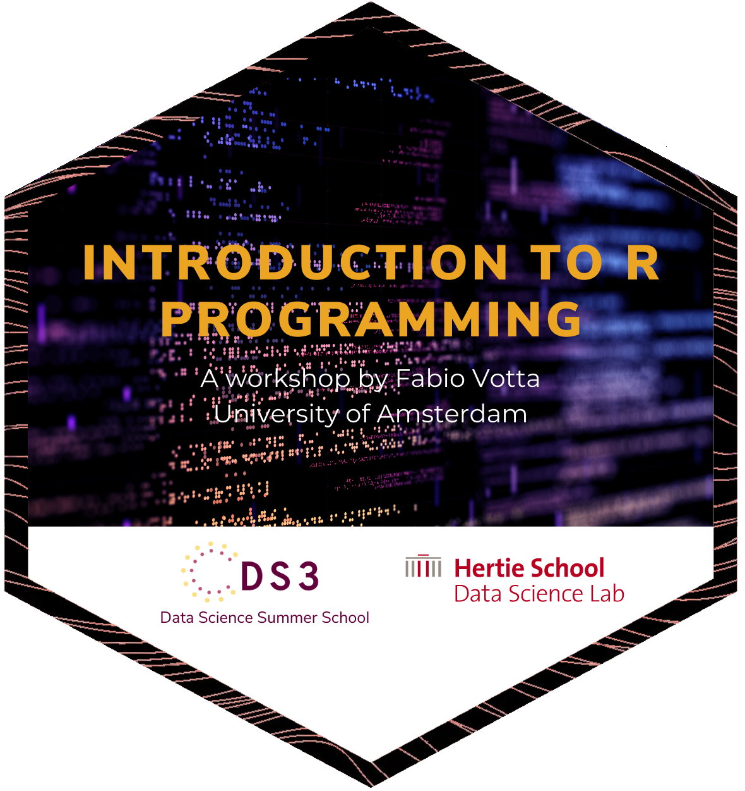

# Introduction to R Programming 

## Data Science Summer School (DS3)

This workshop focuses on the very beginnings of a great journey ahead of you: learning how to use and be comfortable with the statistical programming language R. 

Together we will explore the basics, from the working environment itself, creating functions for simplifying your tasks, to data management with the tidyverse package. 

The overarching goal of the workshop is for you to receive the necessary skill set that will enable you to soon embark on your own data science adventures. 

That being said, the most important aspect of the workshop will be to have fun along the way so that your journey can begin as smoothly and easily as possible.

# Materials

Here you can find the materials for the R Workshop.

## Preperation:

Before starting your adventure, please follow the steps of the [**pre-workshop preparation guide**](https://favstats.github.io/ds3_r_intro/prep/instructions.html):

[**favstats.github.io/ds3_r_intro/prep/instructions.html**](https://favstats.github.io/ds3_r_intro/prep/instructions.html)

It includes detailed instructions to:

1. Install R
2. Install RStudio (make sure you have the **latest version!**)
3. [Download workshop materials](https://www.dropbox.com/sh/jievqgwl43nwnbf/AADhoYQW5oMZ-JygK7aNklHra?dl=0)
4. Install necessary R packages

## Scripts:

The workshop is based on four Rmarkdown scripts (`.Rmd`):

1. `01_r_basics.Rmd`
2. `02_exercises_I.Rmd`
    + covers the R basics
3. `03_datamanipulation.Rmd`
4. `04_exercises_II.Rmd`
    + covers data manipulation with the `tidyverse`

## Slides

+ [Link to Slides](https://favstats.github.io/ds3_r_intro)

The slides are knitted with the help of the {[xaringan](https://github.com/yihui/xaringan)} R package and the source code can be found [here](https://github.com/favstats/ds3_r_intro/blob/main/index.Rmd).

## Alternatives to local RStudio

If you cannot install R or RStudio on your computer for any reason, you have two options to follow along: *Binder* or *Google Colab*.

+ Simply start a **Binder** instance which will create a session of RStudio in your Browser (may take a little bit):

[![Binder](https://img.shields.io/badge/launch-binder-579aca.svg?logo=data:image/png;base64,iVBORw0KGgoAAAANSUhEUgAAAFkAAABZCAMAAABi1XidAAAB8lBMVEX///9XmsrmZYH1olJXmsr1olJXmsrmZYH1olJXmsr1olJXmsrmZYH1olL1olJXmsr1olJXmsrmZYH1olL1olJXmsrmZYH1olJXmsr1olL1olJXmsrmZYH1olL1olJXmsrmZYH1olL1olL0nFf1olJXmsrmZYH1olJXmsq8dZb1olJXmsrmZYH1olJXmspXmspXmsr1olL1olJXmsrmZYH1olJXmsr1olL1olJXmsrmZYH1olL1olLeaIVXmsrmZYH1olL1olL1olJXmsrmZYH1olLna31Xmsr1olJXmsr1olJXmsrmZYH1olLqoVr1olJXmsr1olJXmsrmZYH1olL1olKkfaPobXvviGabgadXmsqThKuofKHmZ4Dobnr1olJXmsr1olJXmspXmsr1olJXmsrfZ4TuhWn1olL1olJXmsqBi7X1olJXmspZmslbmMhbmsdemsVfl8ZgmsNim8Jpk8F0m7R4m7F5nLB6jbh7jbiDirOEibOGnKaMhq+PnaCVg6qWg6qegKaff6WhnpKofKGtnomxeZy3noG6dZi+n3vCcpPDcpPGn3bLb4/Mb47UbIrVa4rYoGjdaIbeaIXhoWHmZYHobXvpcHjqdHXreHLroVrsfG/uhGnuh2bwj2Hxk17yl1vzmljzm1j0nlX1olL3AJXWAAAAbXRSTlMAEBAQHx8gICAuLjAwMDw9PUBAQEpQUFBXV1hgYGBkcHBwcXl8gICAgoiIkJCQlJicnJ2goKCmqK+wsLC4usDAwMjP0NDQ1NbW3Nzg4ODi5+3v8PDw8/T09PX29vb39/f5+fr7+/z8/Pz9/v7+zczCxgAABC5JREFUeAHN1ul3k0UUBvCb1CTVpmpaitAGSLSpSuKCLWpbTKNJFGlcSMAFF63iUmRccNG6gLbuxkXU66JAUef/9LSpmXnyLr3T5AO/rzl5zj137p136BISy44fKJXuGN/d19PUfYeO67Znqtf2KH33Id1psXoFdW30sPZ1sMvs2D060AHqws4FHeJojLZqnw53cmfvg+XR8mC0OEjuxrXEkX5ydeVJLVIlV0e10PXk5k7dYeHu7Cj1j+49uKg7uLU61tGLw1lq27ugQYlclHC4bgv7VQ+TAyj5Zc/UjsPvs1sd5cWryWObtvWT2EPa4rtnWW3JkpjggEpbOsPr7F7EyNewtpBIslA7p43HCsnwooXTEc3UmPmCNn5lrqTJxy6nRmcavGZVt/3Da2pD5NHvsOHJCrdc1G2r3DITpU7yic7w/7Rxnjc0kt5GC4djiv2Sz3Fb2iEZg41/ddsFDoyuYrIkmFehz0HR2thPgQqMyQYb2OtB0WxsZ3BeG3+wpRb1vzl2UYBog8FfGhttFKjtAclnZYrRo9ryG9uG/FZQU4AEg8ZE9LjGMzTmqKXPLnlWVnIlQQTvxJf8ip7VgjZjyVPrjw1te5otM7RmP7xm+sK2Gv9I8Gi++BRbEkR9EBw8zRUcKxwp73xkaLiqQb+kGduJTNHG72zcW9LoJgqQxpP3/Tj//c3yB0tqzaml05/+orHLksVO+95kX7/7qgJvnjlrfr2Ggsyx0eoy9uPzN5SPd86aXggOsEKW2Prz7du3VID3/tzs/sSRs2w7ovVHKtjrX2pd7ZMlTxAYfBAL9jiDwfLkq55Tm7ifhMlTGPyCAs7RFRhn47JnlcB9RM5T97ASuZXIcVNuUDIndpDbdsfrqsOppeXl5Y+XVKdjFCTh+zGaVuj0d9zy05PPK3QzBamxdwtTCrzyg/2Rvf2EstUjordGwa/kx9mSJLr8mLLtCW8HHGJc2R5hS219IiF6PnTusOqcMl57gm0Z8kanKMAQg0qSyuZfn7zItsbGyO9QlnxY0eCuD1XL2ys/MsrQhltE7Ug0uFOzufJFE2PxBo/YAx8XPPdDwWN0MrDRYIZF0mSMKCNHgaIVFoBbNoLJ7tEQDKxGF0kcLQimojCZopv0OkNOyWCCg9XMVAi7ARJzQdM2QUh0gmBozjc3Skg6dSBRqDGYSUOu66Zg+I2fNZs/M3/f/Grl/XnyF1Gw3VKCez0PN5IUfFLqvgUN4C0qNqYs5YhPL+aVZYDE4IpUk57oSFnJm4FyCqqOE0jhY2SMyLFoo56zyo6becOS5UVDdj7Vih0zp+tcMhwRpBeLyqtIjlJKAIZSbI8SGSF3k0pA3mR5tHuwPFoa7N7reoq2bqCsAk1HqCu5uvI1n6JuRXI+S1Mco54YmYTwcn6Aeic+kssXi8XpXC4V3t7/ADuTNKaQJdScAAAAAElFTkSuQmCC)](https://mybinder.org/v2/gh/favstats/ds3_r_intro/rstudio?urlpath=rstudio)

> Note: If you are using Binder don't forget to download the files before you close out the session because otherwise anything you added will be lost!

+ **Google Colab** (note this is based on an older version of the workshop)

Google Colab instantaneously runs Jupyter Notebooks in your browser with an R Kernel.

+ [Part I (R Basics)](https://colab.research.google.com/drive/1dLsdGbkvgn1JbWgsy9Z-pFmPd_2MG4Xu?usp=sharing)
+ [Part II (Data Manipulation with the `tidyverse`)](https://colab.research.google.com/drive/14CRElnKewnp5MnlxhqVu6OOcIXd-Bkaj?usp=sharing)

## Further Resources to learn R

* [Book: R for Data Science](https://r4ds.had.co.nz/)

* [Danielle Navarro's YouTube channel](https://www.youtube.com/channel/UCfNGzUFfsy_3udMY8UyaqBA)

* [Start coding using RStudio.cloud Primers](https://rstudio.cloud/learn/primers)

* [RStudio Cheat Sheets](https://www.rstudio.com/resources/cheatsheets/)

* [Book: A ModernDive into R and the Tidyverse](https://moderndive.com/)

* [TidyTuesday - Community](https://www.tidytuesday.com/)

## Recording 2021 Workshop

Click here for recording on YouTube:

