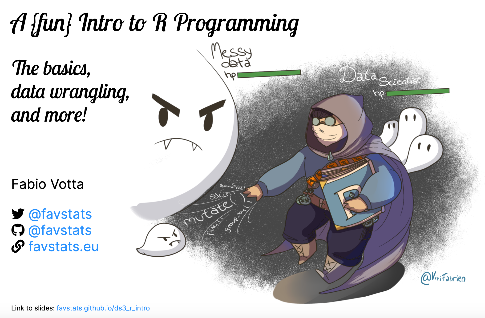

# Data Science Summer School

Here you can find the materials for the R Workshop:

Introduction to R Programming.

+ [Link to Slides](https://favstats.github.io/ds3_r_intro)

**Scripts:**

+ Part I (R Basics)

    + [Google Colab link](https://colab.research.google.com/drive/1dLsdGbkvgn1JbWgsy9Z-pFmPd_2MG4Xu?usp=sharing)

    + [Knitted Rmarkdown HTML](https://favstats.github.io/ds3_r_intro/Rmd/01_rbasics)

+ Part II (Data Manipulation with the `tidyverse`)

    + [Google Colab link](https://tinyurl.com/hackr4321)

    + [Knitted Rmarkdown HTML](https://favstats.github.io/ds3_r_intro/Rmd/02_datamanipulation)

    
+ Solutions to the Exercises

    + [Google Colab link](https://colab.research.google.com/drive/11UXpilfyMAFQtvdMvD7MhS2_XXKvUT9f?usp=sharing)

    + [Knitted Rmarkdown HTML](https://favstats.github.io/ds3_r_intro/Rmd/03_solutions)

If you prefer the **raw Jupyter Notebooks file** (outside of Google Colab), you can find them [here](https://github.com/favstats/ds3_r_intro/tree/main/jupyter).

If you prefer the **raw Rmarkdown files**, you can find them [here](https://github.com/favstats/ds3_r_intro/tree/main/Rmd).

The Slides are knitted with the help of the {[xaringan](https://github.com/yihui/xaringan)} R package and the source code can be found [here](https://github.com/favstats/ds3_r_intro/blob/main/index.Rmd).

