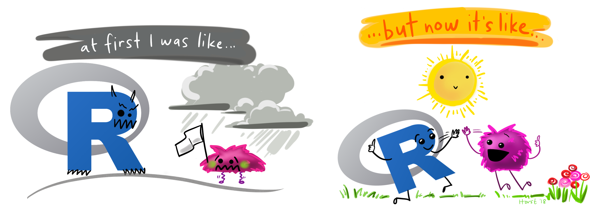

layout: true

<style>
.onehundredtwenty {
  font-size: 120%;
   }

<style>
.ninety {
  font-size: 90%;
   }

.eightyfive {
  font-size: 85%;
   }
   
.eighty {
  font-size: 80%;
   }
   
.seventyfive {
  font-size: 75%;
   }
   
.seventy {
  font-size: 70%;
   }
   
.fifty {
  font-size: 50%;
   }
   
.forty {
  font-size: 40%;
   }
</style>


```{r meta, echo=FALSE}
library(metathis)
meta() %>%
  meta_general(
    description = "Intro to R Programming",
    generator = "xaringan and remark.js"
  ) %>%
  meta_name("github-repo" = "favstats/xxx") %>%
  meta_social(
    title = "Intro to R Programming",
    url = "https://www.favstats.eu",
    og_type = "website",
    og_author = "Fabio Votta",
    twitter_card_type = "summary_large_image",
    twitter_creator = "@favstats"
  )
```

```{r setup, include=FALSE}
# dateWritten <- format(as.Date('2020-05-04'), format="%B %d %Y")
workshop_day <- format(as.Date("2021-07-09"), format="%B %d %Y")
pacman::p_load(tidyverse, fontawesome, tidyverse, knitr)

options(
    htmltools.dir.version = FALSE,
    knitr.table.format = "html",
    knitr.kable.NA = ""
)
knitr::opts_chunk$set(
    warning = FALSE,
    message = FALSE,
    fig.path = "figs/",
    fig.width = 7.252,
    fig.height = 4,
    comment = "#>",
    fig.retina = 3 # Better figure resolution
)
# Enables the ability to show all slides in a tile overview by pressing "o"
xaringanExtra::use_tile_view()
xaringanExtra::use_panelset()
xaringanExtra::use_clipboard()
xaringanExtra::use_share_again()
xaringanExtra::style_share_again(share_buttons = "all")
xaringanExtra::use_extra_styles(
  hover_code_line = TRUE,
  mute_unhighlighted_code = FALSE
)
# xaringanExtra::use_webcam()


knitr::opts_chunk$set(warning = F, message = F) # Whether to display errors
```

---
class: banner


---
name: title-slide
class: primary


#.fancy[`r rmarkdown::metadata$title`] 

###.fancy[`r rmarkdown::metadata$subtitle`]


<br>


Fabio Votta

[`r fa(name = "twitter", fill = "black")` @favstats](http://twitter.com/favstats)<br>
[`r fa(name = "github", fill = "black")` @favstats](http://github.com/favstats)<br>
[`r fa(name = "link", fill = "black")` favstats.eu](https://www.favstats.eu)


`r workshop_day`


---

### Your friendly neighborhood R Instructor

.leftcol40[


]

.rightcol60[
+ Ph.D. Candidate in Political Communication at University of Amsterdam

+ Passionate about R and Data Science

+ I love to travel (when there is no pandemic)

+ I enjoy and (occasionally) create R memes

]

---

### It's normal to struggle at first but it gets better!

```{r, echo = F, out.width="80%", fig.align = 'center'}

```


<!-- {width=50%} -->

.fifty[Illustration adapted from [Allison Horst](https://twitter.com/allison_horst)]

--

  + My experience is that this stuff isn't super easy... but it gets better!
  
--
  
+ Awesome inclusive community that is always ready to help
+ Active blogosphere with use cases and examples


---

## Overview

+ R Basics
  + Operators
  + Objects (inc. vectors)
  + Functions
  + Data frames
  
+ Data Manipulation
  + the tidyverse and friends
  + `janitor`
  + `tidyr`
  + `dplyr`

---


<!-- #### What is  ? -->


#### What is ?

R is a .fancy[statistical] programming language developed for data analysis and visualization.

#### What is ?

RStudio is an IDE (Integrated Development Environment).

* Write, save and open R Code (.R/.Rmd files)

* Provides syntax-highlighting and auto-completion & much more

--

# But why learn ?

<!--  -->


---

<!-- #### What is  ? -->


.leftcol[

#### Why learn ?

<!--  -->


+ Amazing Community .forty[(but I already said that)]

<!-- + Outstanding repertoire of statistical & computational methods -->

<!-- -- -->

<!-- + Integrates well with other programming languages (like Python) -->

<!-- -- -->

<!-- + Beautiful Data Visualization with `ggplot2` and more -->

]

.rightcol[


.fifty[Artist: [Allison Horst](https://github.com/allisonhorst)]

]

---

<!-- #### What is  ? -->


.leftcol60[

#### Why learn ?

<!--  -->


+ Amazing Community .forty[(but I already said that)]

+ Data wrangling is accessible & fun

<!-- + Outstanding repertoire of statistical & computational methods -->

<!-- -- -->

<!-- + Integrates well with other programming languages (like Python) -->

<!-- -- -->

<!-- + Beautiful Data Visualization with `ggplot2` and more -->

]

.rightcol40[

<br>


.fifty[Artist: [Allison Horst](https://github.com/allisonhorst)]

]

---

.leftcol60[

#### Why learn ?

<!--  -->


+ Amazing Community .forty[(but I already said that)]

+ Data wrangling is accessible & fun

+ Outstanding repertoire of statistical & computational methods

<!-- + Integrates well with other programming languages (like Python) -->

<!-- + Beautiful Data Visualization with `ggplot2` and more -->

]

.rightcol40[

<br>


.fifty[ [easystats](https://github.com/easystats/easystats) packageverse for statistical analysis.]


]

---

.leftcol60[

#### Why learn ?

<!--  -->


+ Amazing Community .forty[(but I already said that)]

+ Data wrangling is accessible & fun

+ Outstanding repertoire of statistical & computational methods

+ Integrates well with other programming languages

<!-- + Beautiful Data Visualization with `ggplot2` and more -->

]

.rightcol40[

<br>


.fifty[ [reticulate](https://github.com/easystats/easystats) R package integrates with Python.]


]

---

.leftcol60[

#### Why learn ?

<!--  -->


+ Amazing Community .forty[(but I already said that)]

+ Data wrangling is accessible & fun

+ Outstanding repertoire of statistical & computational methods

+ Integrates well with other programming languages

+ Beautiful data visualization with `ggplot2` 

<br>

<br>


.right[.fifty[Data visualization by [Cédric Scherer](https://www.cedricscherer.com/)]]


]

.rightcol40[


]


---


## Google Colab


For the purposes of this workshop we are going to use **Google Colab**.

Google Colab provides an online environment for teaching.

.blue[Upsides] 

+ No need to set up R and RStudio on your own computer

.red[Downsides]

+ You will have to set up R and RStudio on your own computer (when you want to use R on your own)


---


class: inverse, middle, center

# R Basics

--

### Math Operators


---

### Math Operators

At its core R is just a fancy *calculator*

You can do:

`+` addition

`-` subtraction

`*` multiplication

`/` division

`^` exponentiate

---

### Math Operators

At its core R is just a fancy *calculator*

###  `+` addition


.details[
```{r}
15 + 5
```
]


--

### Mixing operators


.details[
```{r}
(15 + 5) / (2 * 5)
```
]

---

## Short excourse: a new data set appears..


But adding up numbers for no reason is no fun.

--

That's why we will use a data set about .fancy[animals] to learn some R Basics.


.leftcol45[

]

.rightcol55[

[Animal Ageing and Longevity Database](https://www.johnsnowlabs.com/marketplace/the-animal-aging-and-longevity-database/)

Data on over 4200 animals.

Information on age of maturity, gestation or incubation periods but also **longevity (in years)**.

]


---

## Animal Ageing and Longevity Database


Say we want to know how old an animal is in *human years*.

--

We can use the following simple formula to determine that:

<br>

$$\frac{\text{Maximum lifespan human}}{\text{Maximum lifespan non-human animal}} = \text{animal to human years ratio}$$

<br>

*Note: This is just a **very rough** way to determine the conversion ratio. It is **much more** complicated in [reality](https://www.akc.org/expert-advice/health/how-to-calculate-dog-years-to-human-years/).*


---

## Animal Ageing and Longevity Database

.leftcol[

| Animal | Maximum Lifespan |
| --- | --- | 
| Human | 122.5 | 
| Domestic dog | 24.0 | 
| Domestic cat | 30.0 | 
| American alligator | 77.0 | 
| Golden hamster | 3.9 | 
| King penguin | 26.0 | 
| Lion|	27.0 | 
| Greenland shark	 | 392.0 | 
| Galapagos tortoise | 177.0 | 
]


.rightcol[

| Animal | Maximum Lifespan |
| --- | --- | 
| African bush elephant	 | 65.0 | 
| California sea lion	| 35.7	 | 
| Fruit fly		| 0.3	 | 
| House mouse		| 4.0	 |
| Giraffe		| 39.5	 |
| Wild boar		| 27.0	|

Source: [Animal Ageing and Longevity Database](https://www.johnsnowlabs.com/marketplace/the-animal-aging-and-longevity-database/)


]


---

### Math Operators


Say we want to know how old a dog is in *human years*.

--

The observed maximum lifespan of a human is 122.5 years. For dogs it is 24.

--

.details[
```{r}
122.5/24
```
]

So for every year a human ages, a dog "ages" 5.1 human years. How old is a 15 year old dog in human years?

.details[
```{r}
5.104167*15
```
]


---

## So many numbers..


Now it can be quite tedious to juggle all those numbers around. 

Especially if we want to keep reusing numbers we calculated before.

--

Here to simplify that process are:

**Objects**


---

class: inverse, middle, center

# R Basics

### R Objects

---

## R Objects

You can think of R objects as *saving information*, for example simple numbers or just plain text. 

Once saved we can recall it whenever we want by just running the name of the object.

--

> Everything that exists in R is *.red[an object]*. .fifty[~John M. Chambers]

--

We create R objects by using the assignment operator: 

<center>
.large[**`<-`**]
</center>

.right[
.fifty[You can also assign with the **`=`** sign but we will not be using this here.]
]

---

## R Objects

Here is an example:

```{r}
human_lifespan  <- 122.5
dog_lifespan <- 24
```

If we now run the respective objects we retrieve the saved numbers.

.details[
```{r}
human_lifespan
```
]

.details[
```{r}
dog_lifespan
```
]


---


## R Objects


Now we can perform the same calculation as before but this time using objects!

```{r}
dogs_to_human <- human_lifespan / dog_lifespan
```

The object `dogs_to_human` now holds the dog to human years conversion ratio.

--

*Now* we ask again: how old is a 15 year old dog in human years?

.details[
```{r}
dogs_to_human*15
```
]

---

## A quick note on naming things

.leftcol[
> Note that object names could be *anything* here!  I could have chosen to just name them `x`, `y` and `z`. 


I typically use lower-case snake case in this style: `animal_rights`.
 
Also recommended by the [tidyverse style guide](https://style.tidyverse.org/syntax.html). 
]


.rightcol[


]


---

## More operators..

But wait there are more operators: .fancy[logical operators]

--

Logical operators are used for logical tests which can result in either: 

$\text{TRUE}$ or $\text{FALSE}$

*(sometimes this is also called a boolean variable)*


---
class: inverse, middle, center

# R Basics

### Logical Operators

---

## Logical Operators

Let's first create some more objects to try some logical tests!

```{r}
lion_lifespan <- 27
mouse_lifespan <- 4
fly_lifespan <- 0.3
boar_lifespan <- 27
alligator_lifespan <- 77
greenland_shark_lifespan <- 392
galapagos_tortoise_lifespan <- 177
```


---

## Logical Operators


`==` asks whether two values are the same or **equal**

The code below tests the following statement: 

*The maximum lifespan of a lion equals that of a boar.*

.details[
```{r}
lion_lifespan == boar_lifespan
```
]

--

Since both maximum lifespans are `27` this is of course a **`TRUE`** statement.

---

## Logical Operators

`!=`  asks whether two values are the *not* the same or **unequal**

The code below tests the following statement: 

*The maximum lifespan of a lion **does not equal** that of a boar.*

.details[
```{r}
lion_lifespan != boar_lifespan
```
]

--

Since both maximum lifespans are `27` (as we saw before) this is of course a **`FALSE`** statement.


---


## Logical Operators

We can also test whether certain values are greater or smaller than others:

`>` greater than

The code below tests the statement: 

*The lifespan of a human is greater than the lifespan of a fly.*

.details[
```{r}
human_lifespan > fly_lifespan
```
]

--

Since the maximum human lifespan is `122.5` and a fly does not live longer than `0.3` years this is of course a **`TRUE`** statement.

---

## Logical Operators


`<` smaller than

The code below tests the statement: 

*The lifespan of an alligator is smaller than the lifespan of a mouse.*

.details[
```{r}
alligator_lifespan < mouse_lifespan
```
]

--

Since the maximum alligator lifespan is `77` and a mouse lives for `4` years maximum, this is of course a **`FALSE`** statement.

--

Also note the following options:

`>=` greater or equals and `<=` smaller or equals

---


## Combine Logical Operators

We can also combine logical tests by testing multiple statements at the same time:

* `&` stands for "and" (unsurprisingly)
* `|` stands for "or"

For example both `alligator_lifespan` and `fly_lifespan` have to be greater than `mouse_lifespan` for the code below to evaluate as `TRUE`.

.details[
```{r}
alligator_lifespan > mouse_lifespan & 
fly_lifespan > mouse_lifespan
```
]


---


## Combine Logical Operators

We can also combine logical tests by testing multiple statements at the same time:

* `&` stands for "and" (unsurprisingly)
* `|` stands for "or"

If we say `|` (= or) instead, it means either statement evaluation to `TRUE` is enough!

.details[
```{r}
alligator_lifespan > mouse_lifespan | 
fly_lifespan > mouse_lifespan
```
]

---


## Even more objects..?

Now we learned about operators and some basic objects. 

But so far objects have only ever held a *single numeric value*. 

R is of course much more powerful than that and objects can hold any number and types of data.

--

Now we will take a look at **vectors**, or objects that include more than one value.

---
class: inverse, middle, center

# R Basics

### Vectors

---

## Vectors

You can simply imagine vectors as a list of values. They can consist of numbers but also *strings* (or: text).

In order to create a vector in R we make use of `c()` (stands for *concatenate*)


.details[
```{r}
c(1, 100, 1000, 2000, 5000)
```
]

We can also create a vector of strings by using quotes:


.details[
```{r}
c("I", "am", "a", "vector", "of", "strings")
```
]

---


## Vectors

We can combine the lifespans we assigned into objects earlier:


```{r}
animal_lifespans <-  c(greenland_shark_lifespan, dog_lifespan, 
  galapagos_tortoise_lifespan,
  mouse_lifespan, fly_lifespan,
  lion_lifespan, boar_lifespan,
  alligator_lifespan, human_lifespan)
```

.details[
```{r}
animal_lifespans
```
]


---


## Vectors

We can also create a vector of strings by using quotes:

.details[
```{r}
animals <- c("greenland_shark", "dog", 
  "galapagos_tortoise", "mouse", 
  "fly", "lion", "boar",
  "alligator", "human")
```
]


.details[
```{r}
animals
```
]


---


## Vectors

Now if we wanted to get the different year conversation ratios we can simply divide the maximum human age number by the vector.

.details[
```{r}
human_lifespan / animal_lifespans
```
]

Notice how the operation is performed for each item separately and the result is yet another vector.


---

## Vectors

We can also use *logical* operators with vectors:

.details[
```{r}
animal_lifespans > human_lifespan
```
]

Again, notice how the operation is performed for each item separately and the result is yet another vector, this time consisting of `TRUE`s and `FALSE`s.

---


## A logical operator for vectors: `%in%`

An incredibly useful operator for vectors is **`%in%`**. 

The operator checks whether multiple elements occur somewhere in your vectors.

This basic usage looks like this:

$\color{red}{\text{vector1}}$ %in% $\color{orange}{\text{vector2}}$


---


## A logical operator for vectors: `%in%`


Let's say we want to check whether `giraffe`, `greenland_shark` or `lion` occur in `animals`. 

If we use `|` we would have to write something like this:

```{r, eval=F}
animals == "giraffe" | animals == "greenland_shark"  | animals == "lion"
```

--

With `%in%` we can simply pass a vector like this:

```{r, eval=F}
animals_to_check <-  c("giraffe", "greenland_shark", "lion")
animals %in% animals_to_check
```

---

## A logical operator for vectors: `%in%`

Doesn't look that much better? 

Now imagine you have dozens or hundreds of animals to check!

---

## A logical operator for vectors: `%in%`

With **`|`** it's utter chaos.

.fifty[
```{r}
animals == "honey_bee" | animals == "cardiocondyla_obscurior" | animals == "black_garden_ant" | animals == "pheidole_dentata" | animals == "squinting_bush_brown" | animals == "american_lobster" | animals == "firebelly_toad" | animals == "oriental_firebelly_toad" | animals == "yellow_bellied_toad" | animals == "american_toad" | animals == "western_toad" | animals == "yosemite_toad" | animals == "great_plains_toad" | animals == "green_toad" | animals == "canadian_toad" | animals == "red_spotted_toad" | animals == "sonoran_green_toad" | animals == "southern_toad" | animals == "veragoa_stubfoot_toad" | animals == "common_european_toad" | animals == "colorado_river_toad" | animals == "kihansi_spray_toad" | animals == "ridge_headed_toad" | animals == "cuban_toad" | animals == "european_green_toad" | animals == "colombian_giant_toad" | animals == "argentine_toad" | animals == "cane_toad" | animals == "eurura_toad" | animals == "common_horned_frog" | animals == "colombian_horned_frog" | animals == "amazonian_horned_frog" | animals == "ornate_horned_frog" | animals == "green_and_black_dart_poison_frog" 
```
]

---

## A logical operator for vectors: `%in%`


With **`%in%`** it's much more sensible.


.fifty[
```{r}
animals_to_check <-  c("honey_bee", "cardiocondyla_obscurior", "black_garden_ant", "pheidole_dentata", "squinting_bush_brown", "american_lobster", "firebelly_toad", "oriental_firebelly_toad", "yellow_bellied_toad",  "american_toad", "western_toad", "yosemite_toad", "great_plains_toad", "green_toad", "canadian_toad", "red_spotted_toad", "sonoran_green_toad", "southern_toad", "veragoa_stubfoot_toad", "common_european_toad",  "colorado_river_toad", "kihansi_spray_toad", "ridge_headed_toad", "cuban_toad", "european_green_toad","colombian_giant_toad", "argentine_toad", "cane_toad", "eurura_toad", "common_horned_frog", "colombian_horned_frog", "amazonian_horned_frog", "ornate_horned_frog")

```
]


```{r}
animals %in% animals_to_check
```

---

class: inverse, middle, center

# R Basics

### Indexing (with vectors)

---


## Indexing

When you want to know a specific value within your object you can use indexing.

Indexing is done via square brackets `[]`.

The basic setup looks like this:

$$\color{red}{\text{vector}}[\color{orange}{\text{elements}}]$$
---


## Indexing

Exracting the first element of a vector:

```{r}
animal_lifespans[1]
```

```{r}
animals[1]
```

---

## Indexing

Exracting the fifth element of a vector:

```{r}
animal_lifespans[5]
```

```{r}
animals[5]
```


---

## Indexing with logical tests

You can also index using logical tests. 

So if an expression evaluates to `TRUE` it will **keep** that element and when it evaluates to `FALSE` it will remove the **element**.

$$\color{red}{\text{vector}}[\color{orange}{\text{vector of TRUE/FALSE of same length}}]$$
---


## Indexing with logical tests

Let's first take a look at a logical test that extracts all animals that have greater lifespans than humans:


```{r}
longer_living <- animal_lifespans > human_lifespan

longer_living
```

Now we can use square brackets to only keep those animals that have greater lifespans than humans.

```{r}
animals[longer_living]
```


---

## Small excourse: variable types

There are three-ish main types of variables:

--

* **logical**: Boolean/binary, is either `TRUE` or `FALSE`

```{r}
class(TRUE)
```

* **character (or string)**: simple text, including symbols and numbers `"text"`


```{r}
class("I am a character")
```

* **numeric**: Numbers. Mathmatical operators can be used here.

```{r}
class(2020)
```


---
class: inverse, middle, center

# R Basics

### Functions

---

## Functions

> Everything that happens in R is *.red[a function]*. .fifty[~John M. Chambers]

You can think of functions as little machines that (in most cases) process some kind of **input** and create an **output**. 

Input is everything that goes *into* a function:

*   **arguments** you can think of as (pre-determined) input types like a lever or numpad.

*   **values** you can think of as the various settings that the levers or numpads can have.

$$\text{function_name}(\color{orange}{\text{argument}}=\color{lightblue}{\text{value}})$$
---

## Functions

> Everything that happens in R is *.red[a function]*. .fifty[~John M. Chambers]


You can think of functions as little machines that (in most cases) process some kind of **input** and create an **output**. 

Input is everything that goes *into* a function:

*   **arguments** you can think of as (pre-determined) input types like a lever or numpad.

*   **values** you can think of as the various settings that the levers or numpads can have.

*Let's take a look at an example:  the star producer!*

---

```{r, echo = F, out.width="90%"}
include_graphics("https://raw.githubusercontent.com/favstats/hertieschool_datasciencesummerschool/master/img/starproducer2.png")
```


---


## The Star Producer

Let's consider the following function (that does not exist unfortunately):
A `star_producer`!

This little machine creates tiny hand-drawn stars depending on some input. It takes two arguments:

* `how_many` tells the machine how many stars to produce
* `type` tells the machine how the stars should look like (in this case the machine only supports `"squiggly"` stars but it could be upgraded in the future when we learn how to create our own functions later on)

---

## Getting `?help`

How do we know what function takes what kind of arguments?

Within R you can always run the code:

```{r,eval=F}
?function_name
```

And it will open up the *documentation* for the function that will tell you how to use it.

---

## An example function: `seq`

From the help file we can learn that this function is used to 

> "[g]enerate regular sequences".

Its first three arguments are this:

* `from`, `to`: the starting and (maximal) end values of the sequence. 

* `by`: number: increment of the sequence.


Let's first take a look at this within our machine allegory.

---

```{r, echo = F, out.width="90%"}
include_graphics("https://raw.githubusercontent.com/favstats/hertieschool_datasciencesummerschool/master/img/seq2.png")
```

---

## An example function: `seq`
If we would want to create a vector from 1 to 10 that increments by 1 we can simple specify the following input values for the arguments:

* `from`: 1
* `to`: 10
* `by`: 1


This is how that looks like in code:

```{r}
seq(from = 1, to = 10, by = 1)
```


---

### A tip

There is however a much simpler way to create sequences that increment by one.

Simply use a *`:`* between two number and it generates a sequence:

```{r}
1:10
```


```{r}
1000:1010
```

---

### Passing Values

Now there are two ways to pass values to functions in R:

1.   Pass by argument *names* (we already did this above!)
2.   Pass by argument *position*

In the former case, we specifically mention which arguments we want to pass our values to. 

For that, it doesn't matter in which **order** we pass our arguments.

```{r}
seq(to = 10, by = 1, from = 1)
```


---


### Passing Values by position

But: **coders are lazy**.

There is no need to always specify which argument you mean exactly when you can just match *by position*.

So our sequence example could just as well look like this:

```{r}
seq(1, 10, 1)
```

And it works because the documentation tells us that the first three arguments are `from`, `to`, and `by`.

In the future you will see it often that people just leave out the arguments completely so it's good to get used to it. 

---

## More examples: Mean and Median

Many functions have so intuitive arguments that we often don't need to even look up the documentation.

An easy function to use is `mean` which simply calculates the average of a numeric vectors. 

Let's try this with the `animal_lifespans` we created earlier.

```{r}
mean(animal_lifespans)
```

The mean value is quite high!

---

## More examples: Mean and Median

We can also try and take the median value:

```{r}
median(animal_lifespans)
```

When we take the median instead of the mean we can see that this is due to high outliers (the median is of course more robust to extreme values).

There are many more functions in R and we will get to learn some of them during this workshop.


---
class: inverse, middle, center

# R Basics

### Creating our own Functions

--

<center>


</center>


---

## Creating our own functions

We can create our own function using the call: `function()`.

We encode what is supposed to happen within curly brackets `{}`.

Here is the anatomy of a function:


$\color{purple}{\text{my_function_name}}$ <- $\text{function}(\color{orange}{\text{argument}})${


&nbsp;&nbsp;&nbsp; $\color{green}{\text{# function body}}$

&nbsp;&nbsp;&nbsp; $\color{lightblue}{\text{output}}$ <- $\color{orange}{\text{argument}}$

&nbsp;&nbsp;&nbsp; $\text{return(}\color{lightblue}{\text{output}}\text{)}$

}

---

## Creating our own functions

* $\color{purple}{\text{Function name}}$:
  * An identifier by which the function is called 

* $\color{orange}{\text{Argument(s)}}$:
  * Contains a list of values passed to the function
  * Can also contain a default value like this: `argument = 1`

* $\color{green}{\text{Function body}}$:
  * This is executed each time the function is called

* $\color{lightblue}{\text{Return value}}$:
  * Ends function call & sends the value back to the global environment


---


## Creating our own functions

Let's try this basic example:

```{r}
my_function_name <- function(argument){
  # function body
  output <- argument
  return(output)
}
```

```{r}
my_function_name("I am output!")
```

> Tip: In RStudio we can just type `fun` and enter after the popup and RStudio will just automatically generate a template for a function.


---

## Creating our own functions

We can also specify *default values* for our arguments:

```{r}
my_function_name <- function(argument = "I am a default value"){
  # function body
  output <- argument
  return(output)
}
```

```{r}
my_function_name()
```

---

## Creating our own functions

Let's create a slightly more useful function: a function which squares numeric values.

```{r}
square <- function(here_goes_my_number) { 
  output <- here_goes_my_number^2        
  
  return(output)                  
}
```

```{r}
square(2)   
```


---


## Creating our own functions

Let's create a function that is able to calculate dog years into human years. We call the function `dog_to_human_years`.

```{r}
dog_to_human_years <- function(animal_years){

  human_lifespan <- 122.5
  dog_lifespan <- 24

  ratio <- human_lifespan/dog_lifespan

  human_years <- animal_years*ratio

  return(human_years)
}
```

```{r}
dog_to_human_years(15)
```

---

## A quick note on errors and debugging

Soon we will go into exercise mode!

Before that, however, it's important to understand:

> Seasoned R user or complete beginner, **everyone makes mistakes.**
> Encountering errors sometimes is normal.

No R programmer ever just fell from the sky. 

*Debugging* is the process of finding and resolving bugs/problems in code and it **happens all the time**.

---

## A quick note on errors and debugging

So you encountered an error:

```{r, echo = F, message = T}
message("Error: subset of type closure is not subsettable")
```

Steps to take:

* Try to understand what it says.

  * Easier said than done, because many R errors are actually quite cryptic unfortunately.


---

## A quick note on errors and debugging

So you encountered an error:

```{r, echo = F, message = T}
message("Error: subset of type closure is not subsettable")
```

Steps to take:

* Try to understand what it says.

* Google (or other search engines)

  * Search for the error
  * Search for what you were trying to do (add R or rstats)


---

## A quick note on errors and debugging

So you encountered an error:

```{r, echo = F, message = T}
message("Error: subset of type closure is not subsettable")
```

Steps to take:

* Try to understand what it says.

* Google (or other search engines)

* If the error occurs in a function check whether you passed an object type that isn't expected by it.

  * Checking the documentation can help here! Type: `?function`

---

## A quick note on errors and debugging

So you encountered an error:

```{r, echo = F, message = T}
message("Error: subset of type closure is not subsettable")
```

Steps to take:

* Try to understand what it says.

* Google (or other search engines)

* If the error occurs in a function check whether you passed an object type that isn't expected by it.

* Ask for help! Create a *reproducible example* (reprex) and post to online communities

---
class: center, middle, inverse

# Exercises

### It's time to type some R code


<center>

</center>

Google Colab: [tinyurl.com/hackr1234](https://tinyurl.com/hackr1234)

---
class: center, middle, inverse

# Data frames

---

## Data frames

Data frames are the main R object that we will be interacting with. In many ways you already know about them too. 

An example for a dataframe would be the table from the [Animal Ageing and Longevity Database](https://www.johnsnowlabs.com/marketplace/the-animal-aging-and-longevity-database/) we already saw earlier.


| Animal | Maximum Longevity (in years)|
| --- | --- | 
| Human | 122.5.5 | 
| Domestic dog | 24.0 | 
| Domestic cat | 30.0 | 
| American alligator | 77.0 | 


---

## Data frames

To create a data frame from scratch we can simply pass two (same-sized) vectors to the function `data.frame`. 

```{r}
animals_data <- data.frame(animals, animal_lifespans)

animals_data

```


---

## Data frames

To create a data frame from scratch we can simply pass two (same-sized) vectors to the function `data.frame`. 

```{r}
animals_data <- data.frame(animals, animal_lifespans)

animals_data

```


---

## Variable Names

We can also retrieve the variable names of any data frame by passing it to `names()`.

```{r}
names(animals_data)

```


---

## Retrieve variables

If we want to retrieve specific variables from a data frame we can do that via the `$` operator. 

$$\color{red}{\text{dataset}}$\color{orange}{\text{variable_name}}$$


Think of the `$` symbol as a door opener that helps you check what is inside an object.

```{r}
animals_data$animal_lifespans
```


```{r}
animals_data$animals
```

---

## (Re-)Code variables

We can also use the `$` data access to add **new variables**.

In the below case we create a variable called `animal_to_human` which holds all the human to animal years conversions. 

We do that by simply assigning a vector containing that information to `animals_data$animal_to_human` even if that variable doesn't exist yet.

```{r}
animals_data$animal_to_human <- animals_data$animal_lifespans / human_lifespan
```

```{r}
animals_data
```


---


## Indexing

Just as we did before with vectors we can also index data frames with square brackets: `[]`. However, unlike vectors, data frames have **two dimensions**.

So that is why the square brackets in this case take two inputs, separated by a comma:

$$\color{red}{\text{dataset}}[\color{orange}{\text{rows}},\color{lightblue}{\text{columns}}]$$

* The first value after the opening square bracket refers to $\color{orange}{\text{which rows}}$ you want to keep.

* The second value refers to $\color{lightblue}{\text{which columns}}$ you want to keep.

---


## Indexing


So if we only want to keep the first row of the first column of our `animals_data` that is how we would do that:


```{r}
animals_data[1, 1]
```

*If* we want to keep a certain row but all columns we can do this by leaving the *second* value within the square brackets empty.

```{r}
animals_data[1, ]
```

---

## Indexing

The same works for columns but all rows:

```{r}
animals_data[, 1]
```

---

## Indexing with logical tests


We can also do more complex indexing by keeping only the rows that fulfill a certain condition. Let's say we only want to keep the rows that contain animals that have longer lifespans than humans.

```{r}
animals_to_check <- animals_data$animal_lifespans > human_lifespan
```

```{r}
animals_data[animals_to_check, ]
```

---
class: center, middle, inverse

## Break?

---
class: center, middle, inverse

# R Packages

<center>

</center>

---

## R Packages

Packages are at the heart of R: 

* R packages are basically a collection of functions that you load into your working environment.

* They contain code that other R users have prepared for the community.

--

* It's good to know your packages, they can really make your life easier.

* I suggest keeping track of package developments either on Twitter via #rstats

* Or [postsyoumighthavemissed.com](https://postsyoumighthavemissed.com/posts/)

---

## R Packages

You can install packages in R like this using the `install.packages` function:

```{r, eval = F}
install.packages("janitor")
```

However, installing is not enough. You also need to load the package via `library`.

```{r}
library(janitor)
```

Think of `install.packages` as buying a set of tools (for free!) and `library` as pulling out the tools each time you want to work with them.


---
class: center, middle, inverse


---

## What is the `tidyverse`?

The tidyverse describes itself:

> The tidyverse is an opinionated **collection of R packages** designed for data science. All packages share an underlying design philosophy, grammar, and data structures.


<center>

</center>

---

## Core principle: tidy data

* Each variable is in its own column
* Each observation / case is on its own row
* Each value is in a cell

We have already seen tidy data:

| Animal | Maximum Lifespan | Animal/Human Years Ratio  |
| --- | --- | --- | 
| Domestic dog | 24.0 | 5.10 |
| Domestic cat | 30.0 | 4.08 |
| American alligator | 77.0 | 1.59 | 
| Golden hamster | 3.9 | 31.41 |
| King penguin | 26.0 |  4.71 |

---

## Untidy data I

.leftcol[
| Animal | Type | Value  |
| --- | --- | --- | 
| Domestic dog | lifespan | 24.0 |
| Domestic dog | ratio | 5.10 |
| Domestic cat | lifespan | 30.0 |
| Domestic cat | ratio | 4.08 |
| American alligator | lifespan | 77.0 | 
| American alligator | ratio | 1.59 |
| Golden hamster | lifespan | 3.9 |
| Golden hamster | ratio | 31.41 |
| King penguin | lifespan |  26.0 |
| King penguin | ratio |  4.71 |
]

.rightcol[

<br>

<br>

The data on the right has multiple rows with the same observation (animal).

= not tidy

]

---

## Untidy data II

| Animal | Lifespan/Ratio  |
| --- | --- | 
| Domestic dog | 24.0 / 5.10 |
| Domestic cat | 30.0 / 4.08 |
| American alligator | 77.0 / 1.59 | 
| Golden hamster | 3.9 / 31.41 |
| King penguin | 26.0 /  4.71 |

The data above has multiple variables per column.

= not tidy

---

## Core principle: tidy data

<center>

</center>

.fifty[Artist: [Allison Horst](https://github.com/allisonhorst)]
---

## Core principle: tidy data

Tidy data has two decisive advantages:

* Consistently prepared data is easier to read, process, load and save.

* Many procedures (or the associated functions) in R require this type of data.

<center>

</center>

.fifty[Artist: [Allison Horst](https://github.com/allisonhorst)]
---


## Installing and loading the tidyverse

First we install the packages of the tidyverse like this:

```{r, eval = F}
install.packages("tidyverse")
```

Then we load them:

```{r}
library(tidyverse)
```

---


## A new dataset appears..

Before we dive into some functions of the tidyverse, we are going to work with a new data set and clean it a bit.

No worries, we will stay within the animal kingdom but we need a dataset that is a little more complex than what we have seen already.


---

## A new dataset appears..

Before we dive into some functions of the tidyverse, we are going to work with a new data set and clean it a bit.

Meet the Palmer penguins! Data were collected and made available by [Dr. Kristen Gorman](https://www.uaf.edu/cfos/people/faculty/detail/kristen-gorman.php) and the [Palmer Station, Antarctica LTER](https://pal.lternet.edu/).


.leftcol[
<center>

</center>
]

.rightcol[
<center>

</center>
.right[
.fifty[Artist: [Allison Horst](https://github.com/allisonhorst)]]
]


---

## Palmer Penguins

We could install the R package `palmerpenguins` and then access the data. 

However, we are going to use a different method: directly load a .csv file (comma-separated values) into R from the internet.

We can use the `readr` package which provides many convenient functions to load data into R. Here we need `read_csv`:

```{r}
penguins_raw <- read_csv("https://raw.githubusercontent.com/allisonhorst/palmerpenguins/master/inst/extdata/penguins_raw.csv")

```

---


## Palmer Penguins

```{r}
penguins_raw
```

---


## Palmer Penguins

We can also take a look at data set using the `glimpse` function from `dplyr`.

```{r}
glimpse(penguins_raw)
```

---

class: center, middle, inverse

## initial data cleaning

### using `janitor`


<center>

</center>


---

## cleaning with `janitor`

`janitor` is not offically part of the tidyverse package compilation but in my view it is incredibly important to know.

Provides some convenient functions for basic cleaning of the data.

Just like any tidverse-style package it fullfills the following criteria for its functions:

> The data is always the first argument.

This helps us to match by position.

---

## cleaning with `janitor`

One annoyance with the `penguins_raw` data is that it has spaces in the variable names. Urgh! 

R has to put quotes around the variable names that have spaces:

```{r, eval=F}
penguins_raw$`Delta 15 N (o/oo)`
penguins_raw$`Flipper Length (mm)`

```

`janitor` can help with that: 

using a function called `clean_names()`

---


## cleaning with `janitor`

`clean_names()` just magically turns all our messy column names into readable lower-case snake case:

```{r}
library(janitor)

penguins_clean <- clean_names(penguins_raw) 

```

That is how the variables look like now:

```{r, eval=F}
penguins_clean$delta_15_n_o_oo
penguins_clean$flipper_length_mm
```


---

## cleaning with `janitor`


```{r}
glimpse(penguins_clean)

```


---

## cleaning with `janitor`

Now we have another problem. Not all variables in the `penguins_clean` data set are that useful. 

Some of them are the same across all observations. We don't need those variables, like `region`.

```{r}
table(penguins_clean$region)
```

We can use the base R function `table` to quickly get some tabulations of our variable.

---

## cleaning with `janitor`

Here to help get rid of these *constant* columns is the function `remove_constant()`.

```{r, message=T}
penguins_clean <- remove_constant(penguins_clean, quiet = F)


```

```{r, echo = F}
message("Removing 2 constant columns of 17 columns total (Removed: region, stage).")
```


When we set `quiet = F` we even get some input as to what exactly was removed. Neat!


Another useful function in `janitor` is `remove_empty()` which removes all rows or columns that just consist of missing values (i.e. `NA`)


---
class: center, middle, inverse

## Data manipulation using `dplyr`

<center>

</center>


.fifty[Artist: [Allison Horst](https://github.com/allisonhorst)]
---


class: center, middle, inverse

## `select()`

helps you select variables


---

## `select()`


`select()` is part of the dplyr package and helps you select variables

Remember: with tidyverse-style functions, **data is always the first argument**.

---

## `select()`


Here we only keep `individual_id`, `sex` and `species`.

```{r}
select(penguins_clean, individual_id, sex, species)
```


---


class: center, middle, inverse

## `filter()`

helps you filter rows


---

## `filter()`

helps you filter rows


Here we only keep penguins from the Island `Dream`.

```{r}
filter(penguins_clean, island == "Dream")
```

---

## `filter()`

Here the **`%in%`** operator can come in handy again if we want to filter more than one island:

```{r}
islands_to_keep <- c("Dream", "Biscoe")

filter(penguins_clean, island %in% islands_to_keep)
```


---
class: center, middle, inverse

## `mutate()`

helps you create variables


---

## `mutate()`


`mutate` will take a statement like this:

`variable_name = some_calculation`

and attach `variable_name` at the *end of the dataset*.

---

## `mutate()`


Let's say we want to calculate penguin bodymass in kg rather than gram.

```{r}
pg_new <- mutate(penguins_clean, bodymass_kg = body_mass_g/1000)
```

```{r}
select(pg_new, bodymass_kg, body_mass_g)
```

---

class: center, middle, inverse

## `rename()`

helps you rename variables


---

## `rename()`

Just changes the variable name but leaves all else intact:

```{r}
rename(penguins_clean, sample = sample_number)
```


---


class: center, middle, inverse

## `arrange()`

orders your dataset


---

## `arrange()`

You can order your data to show the highest or lowest value first.

Lowest first:

```{r, eval = F}
arrange(penguins_clean, sample_number)
```

Highest first:

```{r, eval = F}
arrange(penguins_clean, desc(sample_number))

penguins_clean %>% 
  separate(species, sep = "\\(", into = c("species", "latin_name")) %>% 
  distinct(individual_id, .keep_all = T)
  arrange(desc(individual_id))
  select(species, )
  gather()
  
# untidy_animals <- read_csv("Animal,Type,Value
# Domestic dog,lifespan,24.0
# Domestic dog,ratio,5.10
# Domestic cat,lifespan,30.0
# Domestic cat,ratio,4.08
# American alligator,lifespan,77.0
# American alligator,ratio,1.59
# Golden hamster,lifespan,3.9
# Golden hamster,ratio,31.41
# King penguin,lifespan,26.0
# King penguin,ratio,4.71")
# 
# saveRDS(untidy_animals, file = "data/untidy_animals.rds")
```

---

class: center, middle, inverse

## `group_by()` and `summarize()`

when you want to aggregate your data (by groups)


---


## `group_by()` and `summarize()`

Sometimes we want to calculate group statistics.

In other languages this is often a pain. With `dplyr` this is fairly easy **and** readable.


---

## `group_by()` and `summarize()`


First we group `penguins_clean` by `sex`.

```{r}
grouped_by_sex <- group_by(penguins_clean, sex)
```

`summarize` works in a similar way to `mutate`:

`variable_name = some_calculation`

```{r}
summarise(grouped_by_sex, avg_culmen_length_mm = mean(culmen_length_mm, na.rm = T))
```

--- 
class: center, middle, inverse

## `count()`

When you want to count how often a certain value within variables(s) occurs

---

## `count()`

Now this is a function that I use all the time. Simply specify which variable you want to count:


```{r, eval = T}
count(penguins_clean, species, sort = T)
```


---


class: center, middle, inverse

# **`%>%`**

## The pipe operator

<center>

</center>


---

## The `%>%` operator

The point of the pipe is to help you write code in a way that is easier to read and understand. 

Let's consider an example with the data manipulation we have done so far:

```{r}
## first I select variables
pg <- select(penguins_clean, individual_id, island, body_mass_g)

## then I filter to only Dream island
pg <- filter(pg, island == "Dream")

## then I convert body_mass_g to kg
pg <- mutate(pg, bodymass_kg = body_mass_g/1000)

## rename individual id to simply id
pg <- rename(pg, id = individual_id)

```

---


## The `%>%` operator

Now this works but the problem is: we have to write a lot of code that repeats itself!

```{r}
pg
```

---

## The `%>%` operator

Another alternative is to *nest all the functions*:

```{r}
rename(mutate(filter(select(penguins_clean, individual_id, island, body_mass_g), island == "Dream"), bodymass_kg = body_mass_g/1000), id = individual_id)

```


---

## The `%>%` operator

*The piping style*: 

Read from top to bottom and from left to right and the `%>%` as "and then".

```{r}
penguins_clean %>% 
  select(individual_id, island, body_mass_g) %>% 
  filter(island == "Dream") %>% 
  mutate(bodymass_kg = body_mass_g/1000) %>% 
  rename(id = individual_id)

```

---

class: center, middle, inverse

# Exercises

### It's time to type some R code


<center>

</center>

Google Colab: [tinyurl.com/hackr4321](https://tinyurl.com/hackr4321)

---
class: center, middle, inverse

# Some Final Things

## If we had more time..

---

## RStudio Tour

<center>

</center>

---

## RStudio Tour

* Program pane
  * Shows R Files, typically .R or .Rmd
  
* Environment pane
  * All the objects that you created during your session
  
* Console pane
  * For executing short snippets of R code
  
* Files pane
  * Gives access to files, but  also help, and plots
  
---

## Using RStudio Projects


[RStudio projects](https://r4ds.had.co.nz/workflow-projects.html) make it straightforward to divide your work into multiple contexts, each with their own working directory, workspace, history, and source documents.


---


## Rmarkdown

<center>

</center>

.fifty[Artist: [Allison Horst](https://github.com/allisonhorst)]

---


## Rmarkdown

.leftcol[
<center>

</center>

.fifty[Artist: [Allison Horst](https://github.com/allisonhorst)]
]

.rightcol[
* create *documents* with R
  
* mix code, text and graphs as you like

* write your thesis, create slides, automated reports, dashboards and interactive web apps all from within [Rmarkdown](https://rmarkdown.rstudio.com/docs/articles/rmarkdown.html)
  
]


---


## Rmarkdown

.leftcol[
<center>

</center>

.fifty[Artist: [Allison Horst](https://github.com/allisonhorst)]
]

.rightcol[
* create *documents* with R
  
* mix code, text and graphs as you like

* write your thesis, create slides, automated reports, dashboards and interactive web apps all from within Rmarkdown
  
]


---

## Further Resources to learn R


* [Book: R for Data Science](https://r4ds.had.co.nz/)

* [Danielle Navarro's YouTube channel](https://www.youtube.com/channel/UCfNGzUFfsy_3udMY8UyaqBA)

* [Start coding using RStudio.cloud Primers](https://rstudio.cloud/learn/primers)

* [RStudio Cheat Sheets](https://www.rstudio.com/resources/cheatsheets/)

* [Book: A ModernDive into R and the Tidyverse](https://moderndive.com/)

* [TidyTuesday - Community](https://www.tidytuesday.com/)


---
class: center, middle, inverse

## Q&A

--

<center>

</center>


---


class: center, middle, inverse

### Thank you for participating!

I hope you had fun!

<center>

</center>


